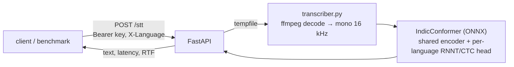

# AI4Bharat STT Server

[](https://github.com/SASHI117/ai4bharat_stt/actions/workflows/ci.yml)


A self-hosted speech-to-text API for the **22 scheduled Indian languages**,
serving AI4Bharat's open [IndicConformer-600M multilingual](https://huggingface.co/ai4bharat/indic-conformer-600m-multilingual)
model behind FastAPI. I ran it on an Azure CPU VM so the team could compare
an open, self-hostable model against commercial APIs in
[stt-benchmark-backend](https://github.com/SASHI117/stt-benchmark-backend).
Field staff sent audio through [users_ai4bharat_stt](https://github.com/SASHI117/users_ai4bharat_stt).



## How it works

- **Model.** A Conformer encoder shared across languages, with a separate
  output head per language (`joint_post_net_<lang>.onnx`). It is distributed
  as ONNX graphs and loaded through `trust_remote_code`. The language is
  therefore an *input*, not something the model detects: sending Hindi audio
  with `X-Language: te` produces Telugu-script garbage.
- **Decoding.** `rnnt` (default) is more accurate. `ctc` is a single
  argmax pass and noticeably faster on CPU. Switch with `STT_DECODE`.
- **Loading.** The ~2.5 GB checkpoint is loaded once, lazily and behind a
  lock. The server preloads it at startup (`STT_PRELOAD=1`) so the first
  request doesn't pay the load time.
- **Serving.** Inference runs in FastAPI's threadpool so a long clip doesn't
  block health checks or other requests. Each response carries latency and
  **real-time factor** (processing time ÷ audio duration).

## API

| Method | Path | Notes |
|---|---|---|
| `POST` | `/stt` | multipart `file`. Headers: `Authorization: Bearer <STT_API_KEY>` and optional `X-Language` (default `te`) |
| `GET` | `/health` | model id and decoder |
| `GET` | `/languages` | `as bn brx doi gu hi kn kok ks mai ml mni mr ne or pa sa sat sd ta te ur` |

```bash
curl -X POST http://localhost:8000/stt \
  -H "Authorization: Bearer $STT_API_KEY" -H "X-Language: hi" \
  -F file=@sample.wav
```

```json
{"filename": "sample.wav", "text": "…", "language": "hi", "decoding": "rnnt",
 "audio_seconds": 6.4, "latency_ms": 2210.5, "rtf": 0.345}
```

Errors: `401` bad key, `400` unsupported language or empty file, `413` file
over `STT_MAX_UPLOAD_MB`, `422` audio that ffmpeg can't decode.

## Setup

The model is **gated**. Request access on its Hugging Face page, then
authenticate with `huggingface-cli login` or `HF_TOKEN`.

```bash
sudo apt install ffmpeg                  # Windows: install ffmpeg and add it to PATH
python -m venv .venv && source .venv/bin/activate
pip install --extra-index-url https://download.pytorch.org/whl/cpu -r requirements.txt
cp .env.example .env                     # set STT_API_KEY
export $(grep -v '^#' .env | xargs)
uvicorn server:app --host 0.0.0.0 --port 8000
```

Transcribe one file without the server:

```bash
python transcriber.py sample.wav --lang te
```

Docker (CPU):

```bash
docker build -t ai4bharat-stt .
docker run --env-file .env -v hf-models:/models -p 8000:8000 ai4bharat-stt
```

For a VM deployment, put the service behind a reverse proxy with TLS
(Nginx + Let's Encrypt) and keep it off a public port. The bearer key only
works if it can't be sniffed.

### Dependency notes

- `onnxruntime` and `huggingface_hub` are imported by the model's remote code,
  so they must be installed even though this repo never imports them directly.
- `torch`/`torchaudio` are pinned below 2.9. From 2.9, `torchaudio.load`
  decodes through `torchcodec` and ignores `backend="ffmpeg"`.

## Tests

```bash
pip install -r requirements-dev.txt
pytest -q
```

The tests replace the model with a fake. They cover authentication,
language defaults and validation, upload limits, temp-file cleanup, and a
client filename like `../../etc/passwd.mp3` never becoming a path. CI runs
them without installing torch.

## Limitations

- One request decodes one file on the CPU. There is no batching or GPU path
  yet, so throughput scales with cores, not requests.
- The caller must know the language. Automatic language ID would need a
  separate model in front of this one.
- Word-level timestamps exist in the model's CTC path, but the API doesn't
  expose them yet.
